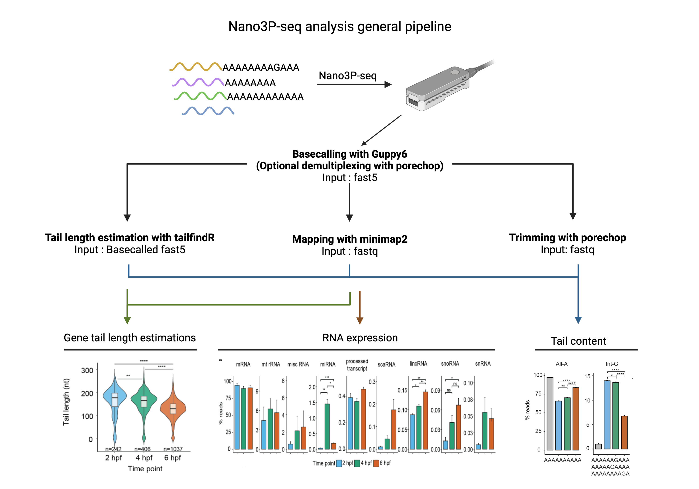
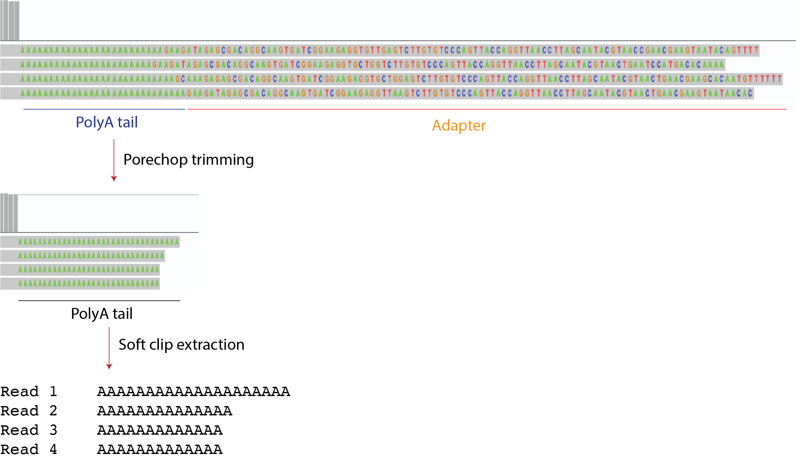

# Nano3P-seq: *Nano*pore *3* *P*rime end-capture *seq*uencing
Bioinformatic analysis of Nano3P-seq nanopore libraries (direct cDNA first strand sequencing with template switching)




## Table of Contents
- [General command line steps used to analyze Nano3P-seq datasets](#General-command-line-steps-used-to-analyze-Nano3P-seq-datasets)
    - [Base-calling and demultiplexing](#Base-calling-and-demultiplexing)
    - [Tail length estimations using tailfindR nano3p-seq version](#Tail-length-estimations-using-tailfindR-nano3p-seq-version)
    - [Trimming the adapter sequence](#Trimming-the-adapter-sequence)
    - [Mapping](#Mapping)
    - [Extracting soft-clipped region of reads](#Extracting-soft-clipped-region-of-reads)
- [Detailed mapping steps](#Detailed-mapping-steps)
    - [Create new annotation files](#Create-new-annotation-files)
    - [Map reads to cytoplasmic ribosomal RNA sequences](#Map-reads-to-cytoplasmic-ribosomal-RNA-sequences)
    - [Map non-rRNA reads to genome](#Map-non-rRNA-reads-to-genome)
- [Software versions used](#Software-versions-used) 
- [Citation](#Citation) 
- [Issues](#Issues)

## General steps used to analyze Nano3P-seq datasets

### Base-calling and demultiplexing

Basecalling is done using Guppy basecaller without adapter trimming. We need the adapter sequence for the tailfindR software. 


Base-calling with Guppy v6 without trimming the adapter :
```bash
guppy_basecalling --device cuda:0 -c dna_r9.4.1_450bps_hac.cfg --barcode_kits EXP-NBD104 --fast5_out --trim_strategy none -ri fast5_files -s output_folder
```

Base-calling and demultiplexing with Guppy v6 without trimming the adapter :
```bash
guppy_basecalling --device cuda:0 -c dna_r9.4.1_450bps_hac.cfg --fast5_out --trim_strategy none -ri fast5_files -s output_folder
```

Demultiplexing the unclassified.fastq file using porechop (Python 3 is required)

```bash
porechop -i unclassified.fastq -b output_folder -t 10 --barcode_threshold 50 --untrimmed 
```

OR 

Demultiplexing the unclassified.fastq file using readducks

* If you use MinKNOW version 22 and later with short read capture (i.e. >20nt), please use the following demultiplexing command instead of porechop. 
```bash
readducks 
```


### Tail length estimations using tailfindR nano3p-seq version
tailfindr Nano3P-seq version can be found as a docker file [here] (https://hub.docker.com/r/adnaniazi/tailfindr_nano3p-seq)

You can download nano3p-seq version of tailfindr [here](https://github.com/adnaniazi/tailfindr/tree/nano3p-seq)
```R
#Prerequisite : tailfindR tool nano3p-seq version
tails <- find_tails(fast5_dir ='fast5_location',
save_dir = './',
csv_filename = 'Tails.csv' ,
num_cores = 10)
```

Note: For each read, Tailfindr will report as output numerical integers corresponding to the tail length in nt (e.g. 120), 0 or NaN. 

Length = 0 ---> when the status of the read is: ```contains_no_polyT_tail```

Length = NaN ---> when the status of the read is: ```no_adaptor_found```

Therefore, tail length equal to 0 means that the software could find the adapter, but next to it, it did not find any polyA tail stretch (so length is 0 nt), whereas NaN means that the read could not be analyzed because the adapter was not found. 

### Trimming the adapter sequence
We need to trim the adapter sequence before analysing the tail content
In order to do so, we need to create an alternative adapters.py file that ONLY contains Nano3p-seq adapter. 
This way we can make the search with less stringency and get a cleaner trimming
You can find the adapters.py file in the porechop_libraries folder

```bash
porechop --extra_end_trim 0 --end_threshold 40 --adapter_threshold 40 -i input.fastq  -t 10 > output.fastq
```


### Mapping
General mapping options used in our pipeline

```bash
# Mapping to transcriptome
minimap2 -ax map-ont --MD reference.fasta input.fastq | samtools view -hSb -F 3844 - > output.sam
samtools view  -f 0x10 -bq 59 output.sam | samtools sort - output.sorted && samtools index output.sorted.bam

# Mapping to genome
minimap2 -ax splice -k14 --MD $ref input.fastq | samtools view -hSb -F 3844 - >  output.sam
samtools sort output.sam output.sorted && rm output.sam && samtools index output.sorted.bam
```

Furthermore, we followed a pipelime comprised of customised scripts in order to extract the following information: 

  -  Filter out the reads that might belong to degraded RNAs
  -  Correctly assign the reads to distinct biotypes 


You can check out [this](#Detailed-mapping-steps) section for the detailed pipeline


### Extracting soft-clipped region of reads
We extract this information for the tail content analysis. It should contain the unmapped tail region of the reads
```bash
python soft_clipped_content.py trimmed.bam > tail_content.tsv
```





### Assigning reads to transcripts/isoforms
```bash
#Prerequisite : isoquant.py tool
python isoquant.py --genedb gtf_file --complete_genedb --bam data.bam --data_type nanopore -o OUTPUT_FOLDER
```


## Detailed mapping steps 

Filtering mapped reads based on annotations and assigning reads to gene biotype 
At this step, using the annotation, we aim to remove the reads coming from degraded RNAs 
We will use a mouse sample run as an example

### Create new annotation files

Refer to this [link](https://github.com/novoalab/Nano3P_Seq/tree/master/R_scripts/annotation_building) for creating bed files from gtf file


### Map reads to cytoplasmic ribosomal RNA sequences

```bash
#Minimap with default options
minimap2 -ax map-ont --MD -t 2 reference_fasta input_fastq > cytrRNA.bam
#Convert BAM into SAM, including only high-quality allignment
samtools view -Sb -F 3844 cytrRNA.bam >  cytrRNA.sam
#Extract high quality and reverse strand only reads and sort/index
samtools view -hb -f 0x10 -bq 59 cytrRNA.sam | samtools sort - cytrRNA.sorted && samtools index cytrRNA.sorted.bam
#Remove intermediate files
rm cytrRNA.bam  cytrRNA.sam
```


### Extract non-rRNA reads

```bash
#Intersect the BAM file reads with rRNA annotation
bedtools intersect -abam cytrRNA.sorted.bam -b Zebrafish_rRNA_Transcript_Ends.bed -wa -wb -bed > cytrRNA_complete.bed
#Extract Read IDs
awk '!seen[$4]++' cytrRNA_complete.bed  | cut -f4 > cytrRNA_complete.reads
#Extract BAM for complete mapping to rRNA
java -jar picard.jar FilterSamReads \
   I=cytrRNA.sorted.bam \
   O=cytrRNA_complete.sorted.bam\
   READ_LIST_FILE=cytrRNA_complete.reads \
   FILTER=includeReadList
#Index the BAM file
samtools index cytrRNA_complete.sorted.bam
#Intersect the BAM file with rRNA Annotation to label the reads as rRNA
bedtools intersect -abam cytrRNA_complete.sorted.bam -b Zebrafish_rRNA_Annotation.bed -wa -wb -bed -S | awk '!seen[$4]++'>  cytrRNA.overlapping.FINAL.bed
# Exclude these reads from fastq
samtools view cytrRNA.sorted.bam | cut -f1 > cytrRNA.reads
#Excluded fastq
seqkit grep --pattern-file cytrRNA.reads --invert-match  input_fastq > nonrRNA.fastq
```

### Map non-rRNA reads to genome

```bash
#Minimap with default options
minimap2 -ax splice -k14 --MD -t 2 $ref nonrRNA.fastq  > nonrRNA.bam
#Convert BAM into SAM, including only high-quality allignment
samtools view -Sb -F 3844 nonrRNA.bam > nonrRNA.sam
#Sort BAM file
samtools view -hb nonrRNA.sam | samtools sort - nonrRNA.sorted && samtools index nonrRNA.sorted.bam
#Convert BAM into BED
bedtools bamtobed -i nonrRNA.sorted.bam > nonrRNA.sorted.bed 
#Remove intermediate files
rm nonrRNA.bam nonrRNA.sam
```


#Assigning complete reads to Biotypes

```bash
#Extract read start coordinates from the BED file
Rscript --vanilla readstarts.R nonrRNA.sorted.bed nonrRNA
#Intersect reads with miRNA Gene annotation to first take miRNA reads apart from the rest
bedtools intersect -abam nonrRNA.sorted.bam -b miRNA_Gene.bed -wa -wb -bed -split -S > miRNAs.bed
#Extract read IDs
awk '!seen[$4]++' miRNAs.bed | cut -f4 > miRNAs.reads
#Intersect read start coordinates with small RNA transcript end coordinates
bedtools intersect -a nonrRNA_readstarts.bed -b SmallRNA_TranscriptEnds.bed -wa -wb > smallRNAs.bed
#Exrtract read IDs
awk '!seen[$4]++' smallRNAs.bed | cut -f4 > smallRNAs.reads
#Make a BAM file for reads mapping to small RNAs
java -jar picard.jar FilterSamReads \
     I=nonrRNA.sorted.bam \
     O=smallRNAs.bam\
     READ_LIST_FILE=smallRNAs.reads \
     FILTER=includeReadList
#Index the BAM file     
samtools index smallRNAs.bam
#Make a BAM file for reads not mapping to small RNAs
java -jar picard.jar FilterSamReads \
     I=nonrRNA.sorted.bam \
     O=longRNAs.bam\
     READ_LIST_FILE=smallRNAs.reads\
     FILTER=excludeReadList
#Index the BAM file     
samtools index longRNAs.bam
#Convert BAM to BED
bedtools bamtobed -i longRNAs.bam > longRNAs.bed
#Extract read starts from BAM file
Rscript --vanilla readstarts.R longRNAs.bed longRNAs
#Intersect read start coordinates with long RNA transcript end coordinates
bedtools intersect -a longRNAs.readstarts.bed -b Transcript_Ends.bed -wa -wb > longRNAs.overlapping.bed
#Extract read IDs
awk '!seen[$4]++' longRNAs.overlapping.bed | cut -f4 > longRNAs.overlapping.reads
#Make a BAM file for reads mapping to long RNAs
java -jar picard.jar FilterSamReads \
     I=nonrRNA.sorted.bam \
     O=longRNAs.overlapping.bam\
     READ_LIST_FILE=longRNAs.overlapping.reads \
     FILTER=includeReadList
#Index BAM file
samtools index longRNAs.overlapping.bam
# We need to remove the reads from miRNAs that are overlapping with smallRNAs or restRNAs
diff longRNAs.overlapping.reads miRNAs.reads |grep ">"|cut -c 3- > miRNAs.longexcluded.reads
diff smallRNAs.reads miRNAs.longexcluded.reads |grep ">"|cut -c 3- > miRNAs.longsmallexcluded.reads
#Extract filtered miRNA BAM file
java -jar picard.jar FilterSamReads \
     I=sorted.bam \
     O=miRNAFINAL.bam\
     READ_LIST_FILE=miRNAs.longsmallexcluded.reads\
     FILTER=includeReadList
#Index BAM file
samtools index miRNAFINAL.bam
#Assigning Read IDs to Biotypes
bedtools intersect -abam longRNAs.overlapping.bam -b Rest_EXON.bed -wa -wb -bed -split -S | awk '!seen[$4]++'> longRNAs.overlapping.FINAL.bed
#Assigning Read IDs to Biotypes
bedtools intersect -abam smallRNAs.bam -b SmallRNA_Gene.bed -wa -wb -bed -split -S | awk '!seen[$4]++' > smallRNAs.overlapping.FINAL.bed
#Assigning Read IDs to Biotypes
bedtools intersect -abam miRNAFINAL.bam -b miRNA_Gene.bed -wa -wb -bed -split -S | awk '!seen[$4]++' > miRNAs.FINAL.bed
#Merge all the files
cat  cytrRNA_complete.bed longRNAs.overlapping.FINAL.bed smallRNAs.overlapping.FINAL.bed miRNAs.FINAL.bed > allRNAs.bed
#Exract Read IDs
awk '!seen[$4]++' allRNAs.bed | cut -f4 > allRNAs.reads
#Create BAM file for nonrRNA FINAL version
java -jar /users/enovoa/boguzhan/Software/picard/build/libs/picard.jar FilterSamReads \
     I=nonrRNA.sorted.bam \
     O=nonrRNA.FINAL.bam\
     READ_LIST_FILE=allRNAs.reads\
     FILTER=includeReadList
#Merge nonrRNA and cyt rRNA reads
samtools merge allRNAs.bam nonrRNA.FINAL.bam cytrRNA_complete.sorted.bam
#Index BAM file
samtools index allRNAs.bam
```


# Creating plots

R script for timepoint dot plots

```R
Rscript dotplot_timepoints.R <tailfindR.file> <bedfile1> <bedfile2> <bedfile3> label

#Example 
Rscript dotplot_timepoints.R zebrafish_tailfindr.csv 2hpf.bed 4hpf.bed 6hpf.bed zebrafish

```


## Reference sequences used

You can find them in the [reference](https://github.com/novoalab/Nano3P_Seq/tree/master/references) folder 

* Curlcake sequences : 
    * curlcake_1_2.fasta
* cDNA Standards : 
    * cdna_std.fasta
* Sequins : 
    * Genome : chrIS.v2.fa
    * Genome annotation : RNAsequins.v2.2.gtf
* Yeast : 
    * Genome : SacCer3.fa
    * Ribosomal RNA : yeast_rRNA.fa
    * Genome annotation : Saccer64.gtf
* Mouse : 
    * [Genome](http://ftp.ensembl.org/pub/release-107/fasta/mus_musculus/dna/Mus_musculus.GRCm39.dna_sm.primary_assembly.fa.gz)
    * Ribosomal RNA : mus_musculus_rRNA.fasta
    * [Genome annotation](http://ftp.ensembl.org/pub/release-107/gtf/mus_musculus/Mus_musculus.GRCm39.107.gtf.gz)
* Zebrafish : 
    * [Genome](http://ftp.ensembl.org/pub/release-107/fasta/danio_rerio/dna/Danio_rerio.GRCz11.dna_sm.primary_assembly.fa.gz)
    * Ribosomal RNA : Zebrafish_rRNA_Maternal_Zygotic.fa
    * [Genome annotation](http://ftp.ensembl.org/pub/release-107/gtf/danio_rerio/Danio_rerio.GRCz11.107.gtf.gz)
* Human : 
    * [Genome](http://ftp.ensembl.org/pub/release-107/fasta/homo_sapiens/dna/Homo_sapiens.GRCh38.dna_sm.primary_assembly.fa.gz)
    * Ribosomal RNA : human_rRNAs.fa
    * [Genome annotation](http://ftp.ensembl.org/pub/release-107/gtf/homo_sapiens/Homo_sapiens.GRCh38.107.gtf.gz)


## Software versions used

* Guppy version 6.0.2
* minimap2 version 2.17
* samtools version 0.1.19
* R version 3.6.0
* TailfindR (Nano3P-seq version)
* picard.jar v2.25.0
* bedtools v2.29.1
* Isoquant v1.3
* porechop v0.2.4
* seqkit
* Python version 3

## Citation
If you find this work useful, please cite: 


Begik O, Diensthuber G, Liu H, Delgado-Tejedor A, Kontur C, Niazi AM, Valen E, Giraldez AJ, Beaudoin JD, Mattick JS and Novoa EM. Nano3P-seq: transcriptome-wide analysis of gene expression and tail dynamics using end-capture nanopore cDNA sequencing. bioRxiv 2022. doi:https://www.biorxiv.org/content/10.1101/2021.09.22.461331v3. 

## Issues
If you have any issues/doubts when using this code, please check previous [Issues](https://github.com/novoalab/Nano3P_Seq/issues). If you still don't find the answer to your question, please open a new [Issue](https://github.com/novoalab/Nano3P_Seq/issues). Thanks!
